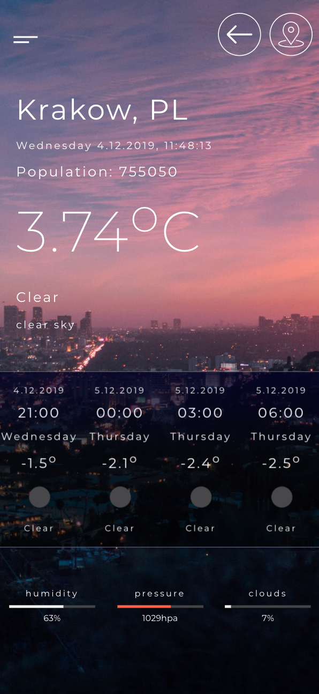

## weather-app website project

This project was created with <b>React</b>, <b>Redux</b> and <b>Styled components</b>.
Main goal of this project was to work with data from API and create nice looking app, 
which represents this data   
Live demo: [weather-app](https://weather-app-e88763.netlify.com). 

  Mobile: 
  

 Standard: 

### Other libraries used in this project:
- React spring
- Formik
